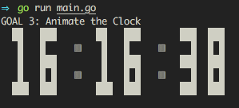

# GOAL 3: Animate the Clock

---

In this section, the previously generated static `clock` will be made live by including animation to make it look like a real time digital clock which refreshes every second.

## Here are the steps as per course.

The following are the steps to be followed in order to achieve the goal as per the course guidelines.

1. Create an infinite loop to update the clock

2. Update the clock every second by including a sleep interval for every second using the `time` package of `go`.

   [time.Sleep(time.Second)](https://golang.org/pkg/time/#Sleep) will stop the world for 1 second

3. Clear the screen before the infinite loop

    (i) Get my library for clearing the screen:

    `go get -u github.com/inancgumus/screen`

    (ii) Then, import it and call it in your code like this:

    `screen.Clear()`

    (iii) If you're using Go Playground instead, do this:

    `fmt.Println("\f")`

 4. Move the cursor to the top-left corner of the screen, before each step of the infinite loop.

    * Call this in your code like this:

        `screen.MoveTopLeft()`

    * If using the `Go` Playground instead, perform the again:

        `fmt.Println("\f")`

---

# Output of the code run.

Here is the output generated after running the code using the specifications.
It clears the screen after every 1 second and moves the cursor to the top left and re-writes the time on the screen giving an impression that the time is being updated in place.

