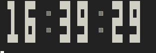

# GOAL 4: Blinking the Separators

---

In this section, the previously generated animated `clock` will be made live by including blinking separators which will give it a real looking clock feel. Along with time which updates every `1 sec` we will also make the separators to blink every `2 sec`.

## Steps to be followed.

The course guidelines provide us the below steps to start with and proceed.

Separators should be visible once in every two seconds.

_Example_:

- 1st second: They're invisible
- 2nd second: visible
- 3rd second: invisible
- 4th second: visible

Following *hints* are provided:

There are two ways to implement the blinking:

- Manipulating the clock array directly (by adding/removing the separators)

- Or: Deciding what placeholders to print when printing the clock

## Output from running code.

Here are a couple screenshots taken after running the code in the standard format of `go run main.go`. The first one has separator colon and the second one does not have. The colons blink for every `2 sec`.

